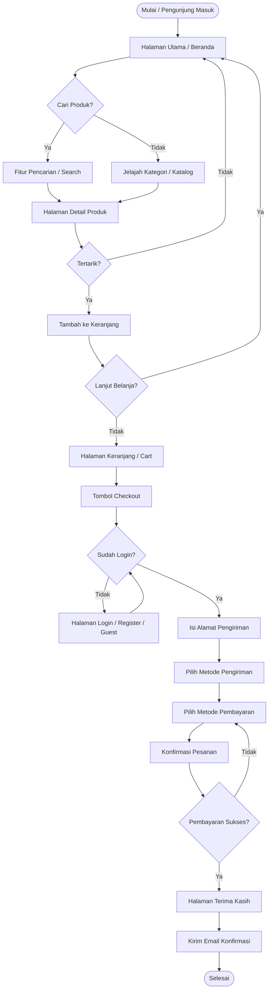

```mermaid
flowchart TD
    A([Mulai / Pengunjung Masuk]) --> B[Halaman Utama / Beranda]

    B --> C{Cari Produk?}
    C -- Ya --> D[Fitur Pencarian / Search]
    C -- Tidak --> E[Jelajah Kategori / Katalog]

    D --> F[Halaman Detail Produk]
    E --> F

    F --> G{Tertarik?}
    G -- Tidak --> B
    G -- Ya --> H[Tambah ke Keranjang]

    H --> I{Lanjut Belanja?}
    I -- Ya --> B
    I -- Tidak --> J[Halaman Keranjang / Cart]

    J --> K[Tombol Checkout]

    K --> L{Sudah Login?}
    L -- Tidak --> M[Halaman Login / Register / Guest]
    M --> L
    L -- Ya --> N[Isi Alamat Pengiriman]

    N --> O[Pilih Metode Pengiriman]
    O --> P[Pilih Metode Pembayaran]
    P --> Q[Konfirmasi Pesanan]

    Q --> R{Pembayaran Sukses?}
    R -- Tidak --> P
    R -- Ya --> S[Halaman Terima Kasih]

    S --> T[Kirim Email Konfirmasi]
    T --> U([Selesai])
```
